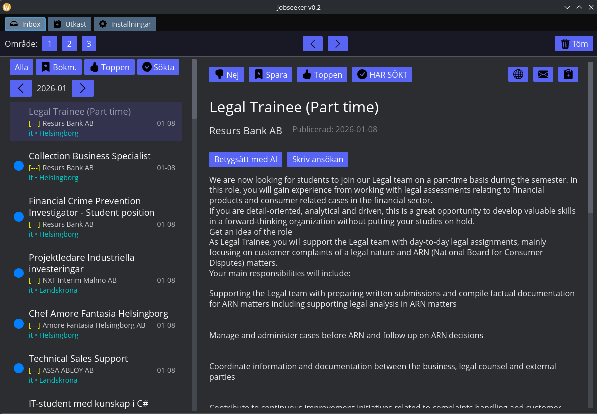

# Jobseeker 🕵️‍♂️ - Gnaga sig till drömjobbet


Jobseeker är ett verktyg under utveckling för att strukturera och förenkla jobbsökandet. Det är byggt enligt **"Gnag"-filosofin**: att gnaga sig igenom tråkiga, repetitiva uppgifter för att spara energi till det som faktiskt betyder något.

> [!IMPORTANT]
> **Projektstatus:** Detta är en tidig utvecklingsversion (Alpha/v0.1). Det är i första hand ett personligt verktyg som delas öppet för den som är nyfiken. Räkna med buggar, ändringar i gränssnittet och att funktioner kan förändras radikalt. Ingen garanti lämnas för funktionalitet eller datasäkerhet.



## Vad är Jobseeker?

Jobseeker är tänkt som en kognitiv förlängning för att:
- **Organisera:** Samla annonser från Arbetsförmedlingen på ett ställe.
- **Automatisera:** Söka i flera områden samtidigt utan att behöva klicka runt manuellt.
- **Skriva:** Ha en enkel plats att skriva ansökningar och få ut dem i användbara format.

## Funktioner (Nuvarande & Experimentella)

- **📄 Ansökningar:** Enkel editor med exportstöd till **PDF** och **Word (.docx)**. (Fungerar, men enkel).
- **🔍 Smart Sökning:** Sök i flera geografiska områden samtidigt med prioriteringsnivåer (P1, P2, P3).
- **🤖 Experimentell AI-Rankning:** Möjlighet att koppla på lokal AI (via Ollama) för att testa automatisk betygssättning av annonser. *Obs: Denna funktion är under utvärdering och kan ge varierande resultat.*
- **🚫 Svartlistning:** Filtrera bort annonser baserat på nyckelord du vill undvika.
- **📋 Rapporteringshjälp:** Knappar för att snabbt kopiera data till Arbetsförmedlingens aktivitetsrapport.
- **🔒 Privat lagring:** All data sparas lokalt i en **RedB**-databas. Ingen molnlagring.

## Kom igång

### Förutsättningar

1. **Rust:** Installeras via [rustup.rs](https://rustup.rs/).
2. **Systembibliotek:**
   - **Ubuntu/Debian:** `sudo apt install libsoup-3.0-dev libgtk-4-dev libadwaita-1-dev`
   - **Fedora:** `sudo dnf install libsoup3-devel gtk4-devel libadwaita-devel`
   - **Windows/MacOS:** Inga extra systembibliotek krävs vanligtvis för att bygga.

### Installation & Körning

```bash
git clone https://github.com/Gnaw-Software/Jobseeker.git
cd Jobseeker
cargo run --release
```

## Licens

Detta projekt är licensierat under **Mozilla Public License 2.0 (MPL-2.0)**. Se [LICENSE](LICENSE) för detaljer.

---
*"Allting är relativt – men att slippa klippa och klistra är absolut bra."*